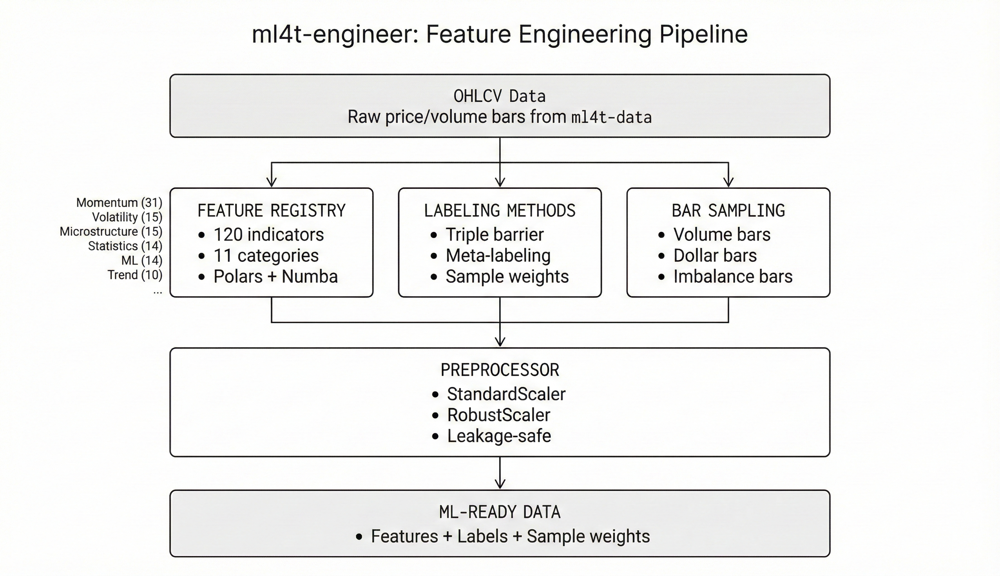

# ml4t-engineer

[](https://www.python.org/downloads/)
[](https://pypi.org/project/ml4t-engineer/)
[](https://opensource.org/licenses/MIT)

Feature engineering for financial machine learning: technical indicators, labeling methods, and alternative bar sampling.

## Part of the ML4T Library Ecosystem

This library is one of five interconnected libraries supporting the machine learning for trading workflow described in [Machine Learning for Trading](https://mlfortrading.io):


Each library addresses a distinct stage: data infrastructure, feature engineering, signal evaluation, strategy backtesting, and live deployment.

## What This Library Does

Transforming raw price data into predictive features is a core task in quantitative research. ml4t-engineer provides:

- 120 technical indicators across 11 categories (momentum, volatility, trend, microstructure, etc.)
- Triple-barrier labeling and other target construction methods from *Advances in Financial Machine Learning*
- Alternative bar sampling (volume bars, dollar bars, tick imbalance bars)
- A feature registry for discovery and configuration

The library is built on Polars with Numba JIT compilation for numerical operations. 60 indicators are validated against TA-Lib at 1e-6 tolerance.



## Installation

```bash
pip install ml4t-engineer
```

Optional dependencies:

```bash
pip install ml4t-engineer[ta]        # TA-Lib backend
pip install ml4t-engineer[viz]       # Visualization
pip install ml4t-engineer[calendars] # Trading calendars
```

## Quick Start

```python
import polars as pl
from ml4t.engineer import compute_features

df = pl.read_parquet("ohlcv.parquet")

# Compute features with default parameters
result = compute_features(df, ["rsi", "macd", "atr", "obv"])

# Or with custom parameters
result = compute_features(df, [
    {"name": "rsi", "params": {"period": 20}},
    {"name": "bollinger_bands", "params": {"period": 20, "std_dev": 2.0}},
])
```

## Feature Registry

```python
from ml4t.engineer.core.registry import get_registry

registry = get_registry()
print(registry.list_all())                    # All 120 features
print(registry.list_by_category("momentum"))  # 31 momentum indicators
print(registry.list_ta_lib_compatible())      # 60 TA-Lib validated
print(registry.list_normalized())             # 37 bounded (0-100, -1 to 1)
```

## Feature Categories

| Category | Count | Examples |
|----------|-------|----------|
| Momentum | 31 | RSI, MACD, Stochastic, CCI, ADX, MFI |
| Microstructure | 15 | Kyle Lambda, VPIN, Amihud, Roll spread |
| Volatility | 15 | ATR, Bollinger, Yang-Zhang, Parkinson |
| Statistics | 14 | Variance, Linear Regression, Correlation |
| ML | 14 | Fractional Diff, Entropy, Lag features |
| Trend | 10 | SMA, EMA, WMA, DEMA, TEMA, KAMA |
| Risk | 6 | Max Drawdown, Sortino, CVaR |
| Price Transform | 5 | Typical Price, Weighted Close |
| Regime | 4 | Hurst Exponent, Choppiness Index |
| Volume | 3 | OBV, AD, ADOSC |
| Math | 3 | MAX, MIN, SUM |

## Triple-Barrier Labeling

```python
from ml4t.engineer.config import LabelingConfig
from ml4t.engineer.labeling import triple_barrier_labels, atr_triple_barrier_labels

# Fixed barriers
tb_config = LabelingConfig.triple_barrier(
    upper_barrier=0.02,    # 2% profit target
    lower_barrier=0.01,    # 1% stop loss
    max_holding_period=20, # 20 bars
)
labels = triple_barrier_labels(
    df,
    config=tb_config,
)

# ATR-based dynamic barriers
atr_config = LabelingConfig.atr_barrier(
    atr_tp_multiple=2.0,
    atr_sl_multiple=1.0,
    atr_period=14,
    max_holding_period=20,
)
labels = atr_triple_barrier_labels(
    df,
    config=atr_config,
)

# Time-based horizons
tb_time_config = LabelingConfig.triple_barrier(
    upper_barrier=0.02,
    lower_barrier=0.01,
    max_holding_period="4h",  # 4 hours
)
labels = triple_barrier_labels(
    df,
    config=tb_time_config,
)
```

## Alternative Bars

```python
from ml4t.engineer.bars import VolumeBarSampler, DollarBarSampler, TickImbalanceBarSampler

# Volume bars (equal volume per bar)
vbars = VolumeBarSampler(volume_threshold=1000).sample(tick_data)

# Dollar bars (equal dollar volume per bar)
dbars = DollarBarSampler(dollar_threshold=1_000_000).sample(tick_data)

# Tick imbalance bars (information-driven)
ibars = TickImbalanceBarSampler(expected_imbalance=100).sample(tick_data)
```

## Technical Characteristics

- **Polars-native**: All computations use Polars expressions
- **Numba-accelerated**: JIT compilation for numerical kernels
- **TA-Lib validated**: 60 indicators validated at 1e-6 tolerance
- **AFML-compliant**: Labeling methods verified against *Advances in Financial Machine Learning*
- **ML-ready outputs**: 37 features produce bounded outputs (0-100, -1 to 1) for direct model input; remaining features work with standard preprocessing (returns, z-scores, robust scaling)

## Related Libraries

- **ml4t-data**: Market data acquisition and storage
- **ml4t-diagnostic**: Signal evaluation and statistical validation
- **ml4t-backtest**: Event-driven backtesting
- **ml4t-live**: Live trading with broker integration

## Development

```bash
git clone https://github.com/applied-ai/ml4t-engineer.git
cd ml4t-engineer
uv sync
uv run pytest tests/ -q
uv run ty check
```

## References

- Lopez de Prado, M. (2018). *Advances in Financial Machine Learning*. Wiley.
- Lopez de Prado, M. (2020). *Machine Learning for Asset Managers*. Cambridge.

## License

MIT License - see [LICENSE](LICENSE) for details.
